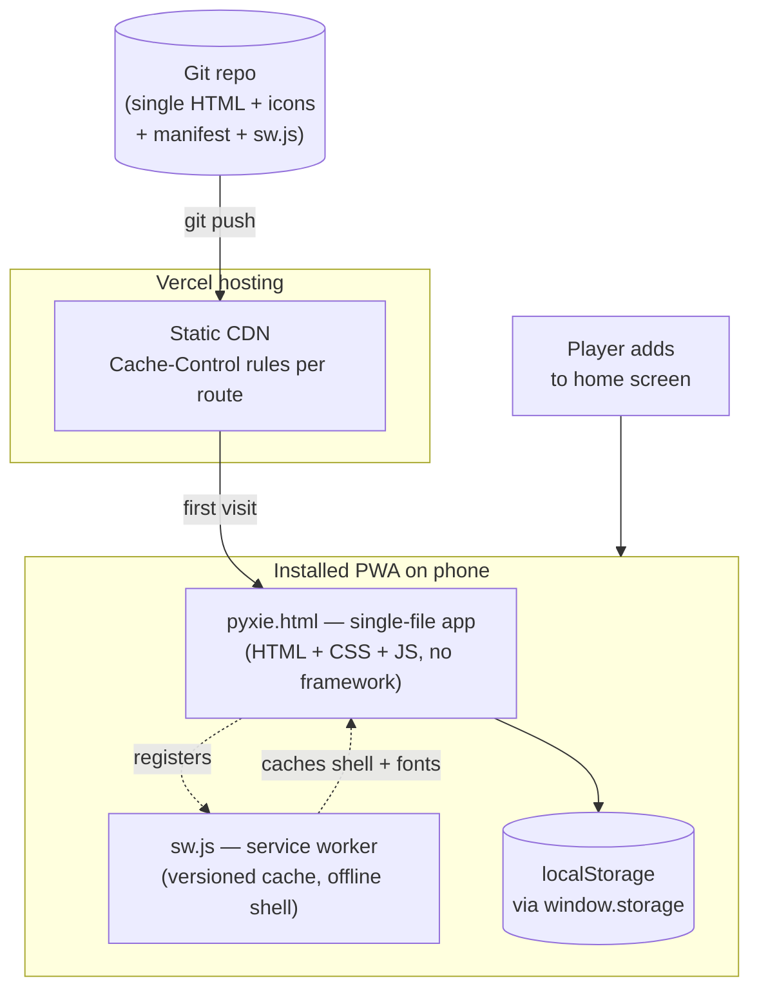
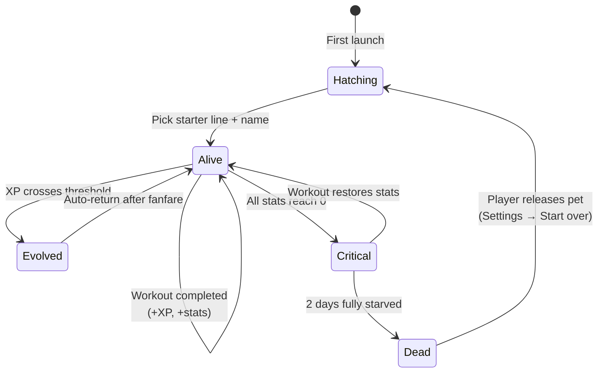
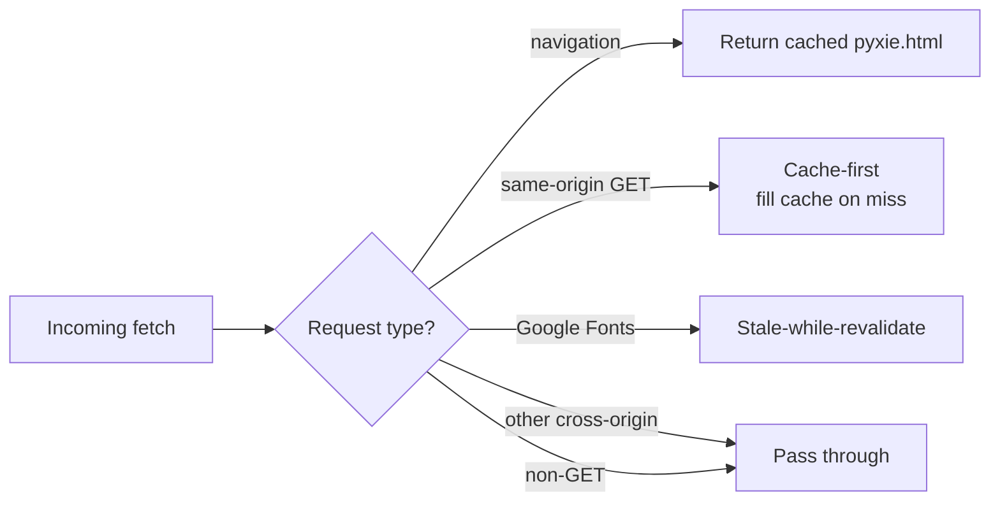

# Pyxie — Engineering Documentation

A retro pixel-art Tamagotchi-style fitness app. Train your virtual pet through five evolution stages by completing daily calisthenics workouts. Shipped as an installable Progressive Web App.

**Audience:** developers and contributors. End-user content lives in [`wiki/PYXIE-WIKI.md`](./wiki/PYXIE-WIKI.md).

---

## 1. Architecture overview



The entire app is a single `pyxie.html` file: vanilla HTML, CSS, and JavaScript with zero runtime dependencies. There is no build step. Persistence runs through `localStorage` behind a thin async wrapper (`window.storage`) so a future native shell can swap the implementation without touching any call sites.

Distribution decisions are tracked under [`architecture/decisions/`](./architecture/decisions/) — ADR-003 is the current accepted path (PWA-first); ADR-001 (Capacitor) and ADR-002 (Expo) remain on the shelf as documented future options.

## 2. Repository layout

| Path | Purpose |
|---|---|
| `pyxie.html` | The entire app — UI, state, workout engine, sprite renderer. |
| `manifest.json` | PWA manifest (name, icons, start_url, display mode). |
| `sw.js` | Service worker. Versioned cache, offline shell, stale-while-revalidate for Google Fonts. |
| `icons/` | App icons: `icon.svg`, `icon-maskable.svg`, `apple-touch-icon.png`. |
| `vercel.json` | Hosting config — route rewrites, per-route `Cache-Control` headers. |
| `.vercelignore` | Excludes `scripts/`, `docs/`, `memory/` from deploy uploads. |
| `scripts/generate-icons.js` | Dep-free generator for the icon set from the Emberling sprite. |
| `scripts/generate-wiki-sprites.js` | Renders the 15 creature SVGs used by the player wiki. |
| `scripts/verify-pwa.js` | Static validator — manifest schema, icon files, required head tags, SW presence, Vercel config. |
| `scripts/test-sw.js` | vm-sandboxed behavioral tests for the service worker lifecycle. |
| `scripts/test-install-nudge.js` | Truth-table tests for install-nudge pure helpers. |
| `docs/architecture/decisions/` | ADRs (distribution path, supersession chain). |
| `docs/wiki/` | Player-facing wiki: creatures, workouts, mechanics. |

## 3. Runtime model



### State shape

The single `state` object is persisted as a JSON blob in `localStorage` under the key `pyxie-state`:

```ts
{
  pet: {
    name: string,
    line: 'ember' | 'tide' | 'verdant',
    stage: 0..4,                    // 0 = Emberling/Dropet/Sprout, 4 = final form
    hunger: 0..100,
    happiness: 0..100,
    energy: 0..100,
    xp: number,
    streak: number,                 // consecutive daily workouts
    alive: boolean,
    born: timestamp,
    lastDecay: timestamp,
    lastWorkout: timestamp | null,
    criticalSince: timestamp | null
  } | null,
  settings: {
    intensity: 'easy' | 'medium' | 'hard',
    complexity: 'beginner' | 'intermediate' | 'advanced',
    alarmEnabled: boolean,
    alarmHour: 0..23,
    alarmMinute: 0..59,
    soundOn: boolean
  },
  history: Array<{                  // capped at 30 most-recent
    date: timestamp,
    intensity, complexity,
    count: number,
    xpGained: number
  }>,
  installNudgeDismissed: boolean,   // iOS one-time hint
  ui: { tab: 'pet' | 'workout' | 'settings' }
}
```

### Decay system

`applyDecay()` runs on app open, every 60s while open, and on visibility-change. It computes elapsed hours since `lastDecay` and subtracts proportionally:

| Stat | Loss per hour | Time to zero from full |
|---|---|---|
| Hunger | 1.6 | ~62 hours |
| Happiness | 1.2 | ~83 hours |
| Energy | 1.0 | 100 hours |

If `lastWorkout` is more than 1 day old, the streak resets to 0. If all three stats hit 0 simultaneously, a `criticalSince` timestamp is set; if it remains critical for more than 48 hours, `alive` becomes `false`.

### Workout engine

A workout is a 8-exercise circuit, randomly drawn from the exercise library for the player's chosen intensity × complexity bucket.

| Segment | Duration |
|---|---|
| Warm up | 60 s |
| Exercise (× 8) | 45 s each |
| Rest (× 7, between exercises) | 15 s each |
| Cool down | 60 s |
| **Total** | **9 min 45 s** |

XP awarded on successful completion:

```
xp = base[intensity] × multiplier[complexity]
   where base       = { easy: 12, medium: 22, hard: 38 }
         multiplier = { beginner: 1.0, intermediate: 1.25, advanced: 1.5 }
```

Range: 12 XP (easy/beginner) to 57 XP (hard/advanced).

Stat boost per completed workout: hunger +28, happiness +22, energy +18. Streak increments by 1 if the previous workout was exactly the prior calendar day.

### Evolution thresholds

```
XP_THRESHOLDS = [0, 60, 180, 420, 900]
```

Pet starts at `stage: 0`. On workout completion, if `xp >= XP_THRESHOLDS[stage + 1]`, the pet evolves to the next stage and the `evo-flash` overlay plays. Stage 4 is the final form — no further evolution.

| Stage | Required XP | Workouts to reach (medium/beginner, 22 XP each) |
|---|---|---|
| 0 → 1 | 60 | 3 |
| 1 → 2 | 180 | 9 (6 more) |
| 2 → 3 | 420 | 20 (11 more) |
| 3 → 4 | 900 | 41 (21 more) |

## 4. PWA layer

### Service worker strategy



Bump `CACHE_VERSION` in `sw.js` to force-invalidate all caches on the next activate. The activate handler also calls `clients.claim()` so the new worker controls already-open pages immediately. The install handler calls `skipWaiting()` for the same reason.

### Install nudge behavior

Platform-aware install prompt logic. Three pure helpers are sentinel-bounded inside `pyxie.html` so the test suite can extract them without a DOM:

| Helper | Returns |
|---|---|
| `isStandaloneDisplay(matchMedia, navigatorStandalone)` | `true` when launched as an installed PWA on either Android Chrome or iOS Safari |
| `isIOSSafariUA(ua)` | `true` only for iOS *Safari* — explicitly excludes CriOS/FxiOS/EdgiOS |
| `shouldShowFirstRunNudge(historyLength, dismissed, isInstalled)` | gates the one-time iOS modal (fires on 3rd workout only) |

Surfaces:
- **Android / desktop Chrome:** stash the `beforeinstallprompt` event, render "Install App" button in Settings. On click, fire the native prompt.
- **iOS Safari:** show "Tap Share → Add to Home Screen" modal once, on the 3rd completed workout. Dismissal is persisted in `state.installNudgeDismissed`.
- **Standalone mode:** all install UI is hidden via `@media (display-mode: standalone)`.

### Hosting (Vercel)

`vercel.json` enforces critical cache policy:

| Route | `Cache-Control` |
|---|---|
| `/sw.js` | `no-cache, no-store, must-revalidate` (mandatory — long-caching a SW means stuck updates) |
| `/pyxie.html` | `no-cache, no-store, must-revalidate` |
| `/manifest.json` | `no-cache` + `Content-Type: application/manifest+json` |
| `/icons/(.*)` | `public, max-age=31536000, immutable` |

Root path rewrites: `/` → `/pyxie.html` (so `start_url: "./pyxie.html"` works from a bare domain).

## 5. Local development

The app is a static file. Any HTTP server works. From the repo root:

```powershell
# Option 1 — Node
npx serve .

# Option 2 — Python
python -m http.server 8000

# Option 3 — VS Code
# Right-click pyxie.html → "Open with Live Server"
```

The service worker requires HTTPS *or* `http://localhost`. `file://` will not register the SW.

## 6. Verification

Three test suites, all dep-free Node (no `package.json` required):

```powershell
node scripts/verify-pwa.js          # 51 static checks: manifest, icons, head tags, SW presence, Vercel
node scripts/test-sw.js             # 21 behavioral checks: SW install/activate/fetch lifecycle in vm sandbox
node scripts/test-install-nudge.js  # 18 truth-table checks: install helper pure functions
```

All three must be green before deploy. Run them as a pre-commit habit.

## 7. Deploy

```powershell
npm i -g vercel        # one-time
vercel login           # one-time, opens browser
vercel                 # first deploy — links project
vercel --prod          # promote to production
```

Post-deploy:
1. Chrome DevTools → Application → Manifest: green
2. Chrome DevTools → Application → Service Workers: `sw.js` activated
3. Lighthouse → PWA: ≥ 90
4. Airplane-mode test on a real install: app boots, pet visible

## 8. Known limitations

- **No background decay.** While the app is closed, decay still accrues (computed from `lastDecay` on next open) but no push notification can warn the user. This is acceptable for the PWA-first phase per ADR-003.
- **iOS `localStorage` eviction.** If a player doesn't open the PWA for ~7 weeks, iOS may evict storage. There is no cloud sync yet; the pet would be lost. Acceptable risk for product-validation phase.
- **No multi-device.** A pet lives on the device it hatched on.
- **Alarms run only when the tab is open.** A real OS-level alarm requires the native wrap (ADR-002 path).

## 9. Future paths

When PWA traction justifies the cost:
- **ADR-002 (Expo + EAS):** the most likely native path. Adds local notifications, haptics, HealthKit/Health Connect, App Store distribution. Costs ~2–4 days of agent-driven UI port.
- **Cloud sync + social:** a separate ADR will gate this. Likely Supabase (auth + Postgres + Edge Functions). Schema is already drafted in ADR-002 §3.
