# 🌟 Pyxie Wiki

A field guide for trainers. Everything you need to keep your pet alive, evolving, and thriving.

> Not sure what Pyxie is? It's a virtual pet that grows stronger every time **you** work out. Pick a starter, train daily, and watch it evolve through five forms.

---

## How it works (the short version)

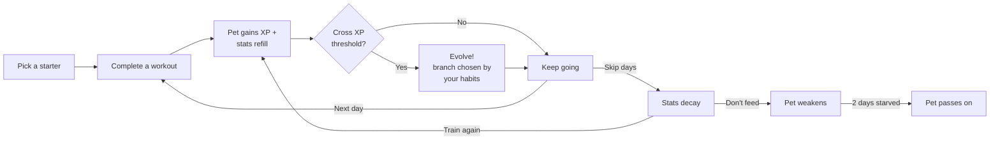

You **feed your pet by working out**. Skip too many days and it gets hungry, sad, and tired. Skip even more, and it dies. There is no second pet without releasing the first.

Every evolution is a **fork in the road**. Which of two children you get depends on the workouts you've actually done — not a setting, not a roll of the dice. Stick to easy walks and you'll meet one creature; chase burpees and you'll meet a different one. See the [branching rules](#how-evolution-branches) below.

---

## Eight starter lines

When your egg hatches, the game rolls one of eight elemental lines for you — blind-box, independent of egg color. Each evolves through five stages. The line your pet receives is permanent for that pet's life.

| Line | Theme | Vibe |
|---|---|---|
| 🔥 **Ember** | Forged in fire | Aggressive, fierce, glow-in-the-dark warmth |
| 💧 **Tide** | Born of the deep | Calm, flowing, the patient one |
| 🌿 **Verdant** | Rooted in earth | Steady, ancient, wild |
| 🌬️ **Gale** | Carried on the wind | Mobile, quick, sky-bound |
| 🪨 **Stone** | Patient and unbroken | Heavy, mineral, isometric |
| 🌑 **Umbra** | Shaped in shadow | Cool dusk palette, night-training feel |
| ✨ **Aurora** | Lit from within | Pastel and gentle, recovery-coded |
| ⚡ **Static** | Charged and restless | Electric yellows, high-frequency intervals |

There is no "best" line — only the one that looks coolest evolving in your hand. All eight follow the same XP curve. The full roster spans **248 nodes** (31 per line) across 5 stages, with each pet getting a unique hue tint at hatch so no two are visually identical.

---

## How evolution branches

Every time your pet hits an XP threshold, the game checks your **workout history** and picks one of two children for the next stage. The axis flips at each step:

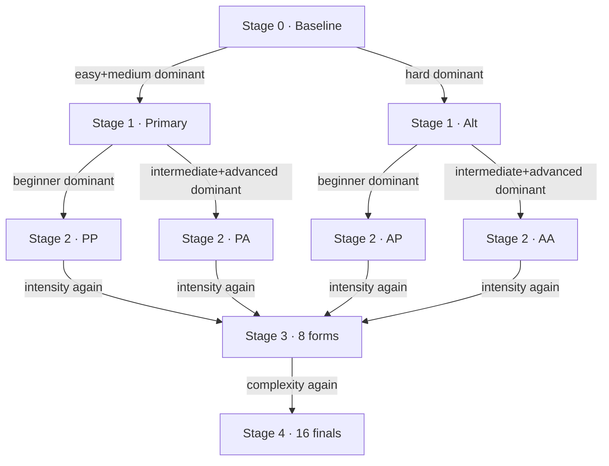

| Stage transition | Axis | Primary side | Alt side |
|---|---|---|---|
| 0 → 1 | **Intensity** | easy + medium | hard |
| 1 → 2 | **Complexity** | beginner | intermediate + advanced |
| 2 → 3 | **Intensity** | easy + medium | hard |
| 3 → 4 | **Complexity** | beginner | intermediate + advanced |

Ties favour the primary side, so a pet trained on pure defaults walks down the canonical spine. Mix it up to see the rarer forms.

> **A path is its name.** Forms are labelled by the choices it took to get there. `ember-pap` = Ember → primary → alt → primary. The path is permanent for that pet; release it from the settings tab if you want a different lineage.

---

## 🔥 Ember evolution tree

> *Forged in fire.*

Sixteen named forms across five stages. The spine (all-primary) leads to **Drakorath**. Cranking workouts harder or more complex peels off into the alt branches.

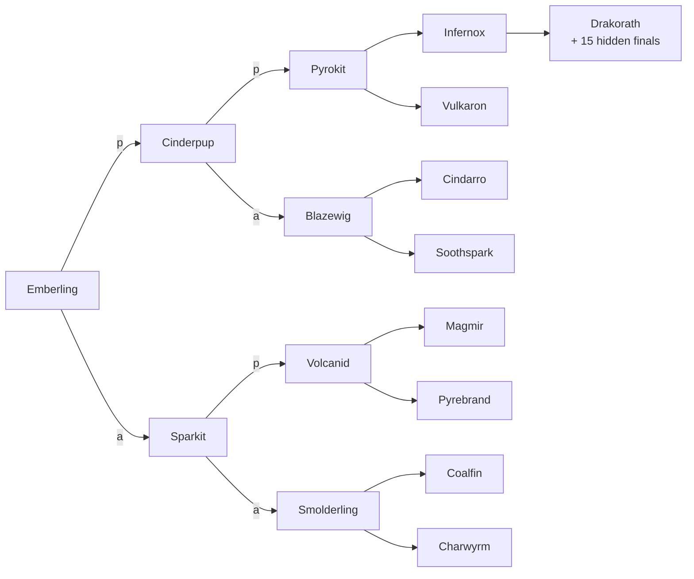

### Stage 0 — baseline
| Form | Path | Sprite |
|---|---|---|
| **Emberling** | `ember` |  |

### Stage 1 — split on intensity (60 XP)
| Form | Path | Sprite |
|---|---|---|
| **Cinderpup** | `ember-p` (easy+medium) |  |
| **Sparkit** | `ember-a` (hard) | 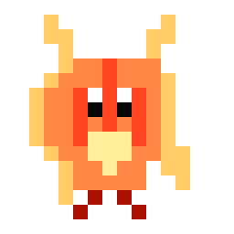 |

### Stage 2 — split on complexity (180 XP)
| Form | Path | Sprite |
|---|---|---|
| **Pyrokit** | `ember-pp` |  |
| **Blazewig** | `ember-pa` | 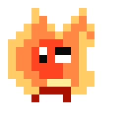 |
| **Volcanid** | `ember-ap` |  |
| **Smolderling** | `ember-aa` |  |

### Stage 3 — split on intensity (420 XP)
| Form | Path | Sprite |
|---|---|---|
| **Infernox** | `ember-ppp` |  |
| **Vulkaron** | `ember-ppa` |  |
| **Cindarro** | `ember-pap` | 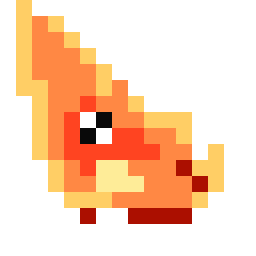 |
| **Soothspark** | `ember-paa` | 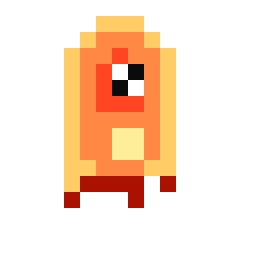 |
| **Magmir** | `ember-app` | 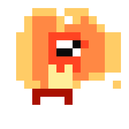 |
| **Pyrebrand** | `ember-apa` |  |
| **Coalfin** | `ember-aap` | 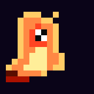 |
| **Charwyrm** | `ember-aaa` | 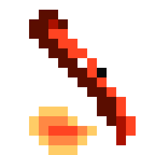 |

### Stage 4 — split on complexity (900 XP)
| Form | Path | Sprite |
|---|---|---|
| **Drakorath** | `ember-pppp` |  |

> Fifteen further stage-4 finals (`ember-pppa`, `ember-ppap`, … `ember-aaaa`) exist in the tree but are unnamed and render as procedural placeholders. They unlock for players who diverge from the all-primary spine at the final fork.

---

## 💧 Tide evolution tree

> *Born of the deep.*

The water line. Calm starters branch into either patient currents or stormy abyssal forms. Spine ends at **Leviathos**.

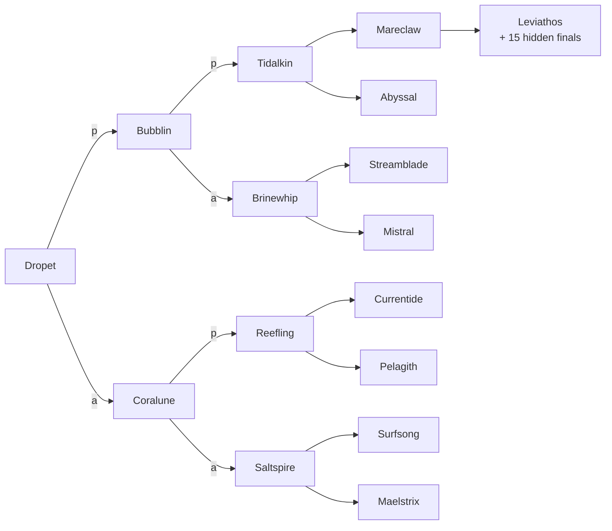

### Stage 0 — baseline
| Form | Path | Sprite |
|---|---|---|
| **Dropet** | `tide` |  |

### Stage 1 — split on intensity
| Form | Path | Sprite |
|---|---|---|
| **Bubblin** | `tide-p` |  |
| **Coralune** | `tide-a` |  |

### Stage 2 — split on complexity
| Form | Path | Sprite |
|---|---|---|
| **Tidalkin** | `tide-pp` |  |
| **Brinewhip** | `tide-pa` |  |
| **Reefling** | `tide-ap` |  |
| **Saltspire** | `tide-aa` |  |

### Stage 3 — split on intensity
| Form | Path | Sprite |
|---|---|---|
| **Mareclaw** | `tide-ppp` | 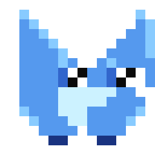 |
| **Abyssal** | `tide-ppa` |  |
| **Streamblade** | `tide-pap` |  |
| **Mistral** | `tide-paa` |  |
| **Currentide** | `tide-app` |  |
| **Pelagith** | `tide-apa` |  |
| **Surfsong** | `tide-aap` |  |
| **Maelstrix** | `tide-aaa` |  |

### Stage 4 — split on complexity
| Form | Path | Sprite |
|---|---|---|
| **Leviathos** | `tide-pppp` | 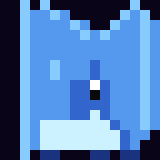 |

---

## 🌿 Verdant evolution tree

> *Rooted in earth.*

The plant line. Patient growers settle into mossy steadiness; aggressive trainers grow thorns. Spine ends at **Sylvadrake**.

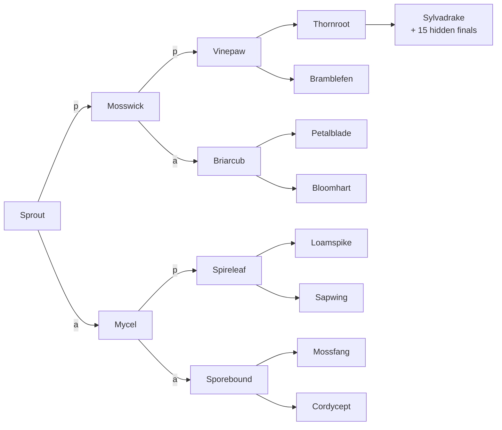

### Stage 0 — baseline
| Form | Path | Sprite |
|---|---|---|
| **Sprout** | `verdant` |  |

### Stage 1 — split on intensity
| Form | Path | Sprite |
|---|---|---|
| **Mosswick** | `verdant-p` |  |
| **Mycel** | `verdant-a` |  |

### Stage 2 — split on complexity
| Form | Path | Sprite |
|---|---|---|
| **Vinepaw** | `verdant-pp` |  |
| **Briarcub** | `verdant-pa` |  |
| **Spireleaf** | `verdant-ap` |  |
| **Sporebound** | `verdant-aa` |  |

### Stage 3 — split on intensity
| Form | Path | Sprite |
|---|---|---|
| **Thornroot** | `verdant-ppp` |  |
| **Bramblefen** | `verdant-ppa` |  |
| **Petalblade** | `verdant-pap` |  |
| **Bloomhart** | `verdant-paa` | 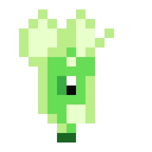 |
| **Loamspike** | `verdant-app` |  |
| **Sapwing** | `verdant-apa` |  |
| **Mossfang** | `verdant-aap` |  |
| **Cordycept** | `verdant-aaa` |  |

### Stage 4 — split on complexity
| Form | Path | Sprite |
|---|---|---|
| **Sylvadrake** | `verdant-pppp` |  |

---

## 🌬️ Gale evolution tree

> *Carried on the wind.*

Phase-3 baseline (ADR-0004). The wind line trades grounded power for mobility — fluid silhouettes, storm-grey palette. Spine ends at **Tempestar**.

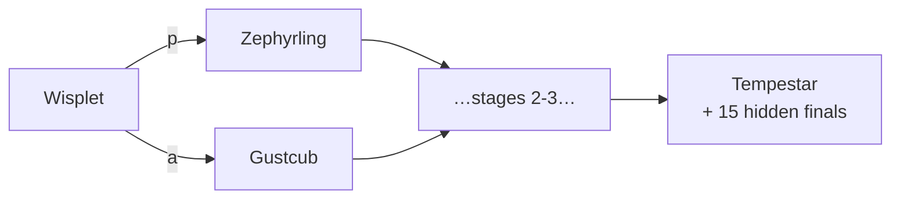

| Stage | Spine form | Alt-1 form | Sprite (spine) |
|---|---|---|---|
| 0 | **Wisplet** (`gale`) | — |  |
| 1 | **Zephyrling** (`gale-p`) | **Gustcub** (`gale-a`) |  |
| 2 | **Galekit** (`gale-pp`) | Skydancer, Squallhound, Boltwing |  |
| 3 | **Cyclonix** (`gale-ppp`) | 7 alt forms (Stormvane … Stormwyrm) |  |
| 4 | **Tempestar** (`gale-pppp`) | 15 unauthored leaves (incl. Skyrax chaos-leaf) |  |

> Spine grids ship now; the 21 alt-branch grids per stage backfill in follow-up commissions per ADR-0004 rollout cadence. Unauthored nodes render via procedural placeholder with a `?` badge.

---

## 🪨 Stone evolution tree

> *Patient and unbroken.*

Phase-3 baseline (ADR-0004). The earth line rewards isometric, low-and-slow work — heavy silhouettes, warm-earth palette. Spine ends at **Megalith**.

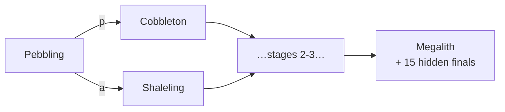

| Stage | Spine form | Alt-1 form | Sprite (spine) |
|---|---|---|---|
| 0 | **Pebbling** (`stone`) | — |  |
| 1 | **Cobbleton** (`stone-p`) | **Shaleling** (`stone-a`) | 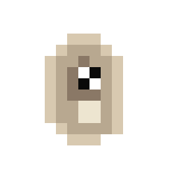 |
| 2 | **Granicub** (`stone-pp`) | Cobblerend, Granibrand, Shaledrake |  |
| 3 | **Boulderth** (`stone-ppp`) | 7 alt forms (Bouldervane … Obsiwyrm) |  |
| 4 | **Megalith** (`stone-pppp`) | 15 unauthored leaves (incl. Stonerax chaos-leaf) | 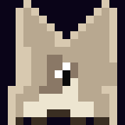 |

> Same rollout pattern as Gale — spine first, alt-branch art on follow-up PRs.

---

## How many workouts to reach final form?

If you're doing **medium intensity / beginner complexity** (22 XP per workout) the path looks like this:

| Goal | Workouts |
|---|---|
| Stage 2 (first evolution) | 3 |
| Stage 3 | 9 |
| Stage 4 | 20 |
| Stage 5 (final form) | **41** |

Crank intensity or complexity up to shorten the road. Maxing out (**hard / advanced**, 57 XP per workout) gets you to final form in **16 workouts**.

---

## The three stats

Your pet has three needs that decay around the clock — whether the app is open or not.

| Stat | What it tracks | Decay rate | Time to zero |
|---|---|---|---|
| 🍖 **Hunger** | Filled by working out | -1.6 / hour | ~62 hours |
| 💖 **Happiness** | Tap your pet, work out | -1.2 / hour | ~83 hours |
| ⚡ **Energy** | Workouts also refill this | -1.0 / hour | ~100 hours |

A completed workout refills hunger by **+28**, happiness by **+22**, energy by **+18** — enough to bring all three back to full from medium-low.

If **all three** stats reach 0 at the same time, your pet enters **critical condition**. If you don't train within **48 hours** from that point, your pet dies.

A skipped day costs you your streak — but not your pet. The pet only dies from prolonged neglect, not from a missed Saturday.

---

## Workout settings

Two dials shape every session: **intensity** (how hard) and **complexity** (how skilled).

### Intensity

| Setting | XP base | Examples |
|---|---|---|
| **Easy** | 12 | Wall push-ups, glute bridges, calf raises |
| **Medium** | 22 | Push-ups, lunges, mountain climbers |
| **Hard** | 38 | Burpees, jump squats, plyo push-ups |

### Complexity multiplier

| Setting | Multiplier | Best for |
|---|---|---|
| **Beginner** | × 1.0 | Brand new or returning from a break |
| **Intermediate** | × 1.25 | Comfortable with form, want a challenge |
| **Advanced** | × 1.5 | Have a real strength base |

XP per workout = base × multiplier. So Easy/Beginner = 12 XP, Hard/Advanced = 57 XP.

### Session shape

Every workout follows the same format. **9 minutes 45 seconds** total:

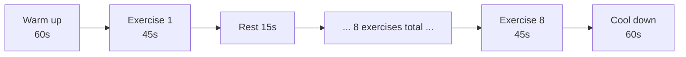

Exercises are randomly drawn from the catalogue below for your chosen difficulty bucket. Hit **Shuffle** in the workout view to re-roll the list before you start.

---

## 📋 Full exercise catalogue

Every exercise lives in one of nine buckets — three intensities × three complexities.

### 🟢 Easy

<b>Easy · Beginner</b> — the gentlest 12 XP route in the game

| # | Exercise | Cue |
|---|---|---|
| 1 | Wall Push-ups | Stand arm-length from a wall. Lean in, press out. |
| 2 | Bodyweight Squats | Feet shoulder-width. Sit back, chest tall. |
| 3 | Glute Bridges | On your back, lift hips, squeeze glutes at the top. |
| 4 | Standing March | Lift knees high, alternating sides. |
| 5 | Arm Circles | Arms out, small circles forward then backward. |
| 6 | Cat-Cow | On hands & knees, arch and round your spine. |
| 7 | Calf Raises | Rise onto toes, lower slow. |
| 8 | Standing Side Bends | Reach overhead, lean side to side. |
| 9 | Seated Leg Extensions | Sit tall, straighten one leg, switch. |
| 10 | Wall Sit | Back to wall, slide down to a comfortable angle. |

<b>Easy · Intermediate</b>

| # | Exercise | Cue |
|---|---|---|
| 1 | Incline Push-ups | Hands on a chair or counter. Lower chest to it. |
| 2 | Reverse Lunges | Step back, drop the back knee, drive up. |
| 3 | Bird Dogs | Opposite arm and leg extended, stay steady. |
| 4 | Dead Bug | Back flat, opposite arm/leg lower slowly. |
| 5 | Step-ups | Use a sturdy step. Drive through the heel. |
| 6 | Side-lying Leg Raises | Lift top leg, control down. |
| 7 | Standing Knee-to-Elbow | Crunch knee up, elbow down. |
| 8 | Plank Knee Drops | High plank, tap knees down lightly. |
| 9 | Glute Bridge March | Hips up, lift one foot at a time. |
| 10 | Sumo Squat | Wide stance, toes out, sit straight down. |

<b>Easy · Advanced</b>

| # | Exercise | Cue |
|---|---|---|
| 1 | Tempo Squats (3s down) | Slow descent, controlled rise. |
| 2 | Hand Release Push-ups | Chest to floor, lift hands, press up. |
| 3 | Single-Leg Glute Bridge | One leg straight up, drive other heel. |
| 4 | Curtsy Lunges | Step back diagonally, sink low. |
| 5 | Plank Shoulder Taps | High plank, tap opposite shoulder. |
| 6 | Hollow Body Hold | Low back pressed to floor, arms & legs lifted. |
| 7 | Side Plank | Stack feet, hip high, breathe. |
| 8 | Reverse Snow Angels | Lie face down, sweep arms hip to overhead. |
| 9 | Standing Knee Drives | Drive knees up explosively but controlled. |
| 10 | Wall Sit + Calf Raise | Hold the sit, pulse onto toes. |

### 🟡 Medium

<b>Medium · Beginner</b> — the default loadout

| # | Exercise | Cue |
|---|---|---|
| 1 | Push-ups | Drop to knees if needed. Chest leads. |
| 2 | Walking Lunges | Step forward, drop back knee, alternate. |
| 3 | Mountain Climbers | High plank, drive knees in. |
| 4 | Jumping Jacks | Arms and legs in rhythm. |
| 5 | Plank Hold | Hips level, breathe steady. |
| 6 | Bicycle Crunches | Elbow to opposite knee, slow & controlled. |
| 7 | Squat Hold Pulses | Drop to a squat, pulse small. |
| 8 | Russian Twists | Heels up if you can. Tap side to side. |
| 9 | High Knees | Quick steps, knees to hip height. |
| 10 | Push-up Shoulder Tap | Push-up, tap one shoulder, alternate. |

<b>Medium · Intermediate</b>

| # | Exercise | Cue |
|---|---|---|
| 1 | Squat-to-Stand Tempo | 3 seconds down, 1 up. |
| 2 | Tricep Dips (Chair) | Hands on chair edge, dip and press. |
| 3 | Reverse Crunches | Knees up, lift hips toward ribs. |
| 4 | Side Lunges | Step wide, sit one leg, switch. |
| 5 | Spider Plank | Plank, drive knee to same-side elbow. |
| 6 | Lateral Hops | Hop side to side over a line. |
| 7 | Single-Leg Hip Hinge | Hinge forward, back leg straight. |
| 8 | V-ups | Reach hands to toes, slow lower. |
| 9 | Plank to Down-dog | Flow from plank to inverted V. |
| 10 | Reverse Lunge + Knee Drive | Step back, drive front knee up. |

<b>Medium · Advanced</b>

| # | Exercise | Cue |
|---|---|---|
| 1 | Decline Push-ups | Feet on a step. Chest leads down. |
| 2 | Bulgarian Split Squat | Back foot elevated. Slow descent. |
| 3 | Pike Push-ups | Hips high, lower head between hands. |
| 4 | Toe Touches | Lie on back, lift legs, reach. |
| 5 | Plank to Push-up | Forearm plank to high plank and back. |
| 6 | Cossack Squats | Wide stance, shift to one side, switch. |
| 7 | Hollow Body Rocks | Stay hollow, rock heels to head. |
| 8 | Archer Push-ups | Shift weight side to side. |
| 9 | Single-Leg Deadlift (no weight) | Hinge forward, back leg up. |
| 10 | Side Plank Hip Dips | Lower hip, lift back up. |

### 🔴 Hard

<b>Hard · Beginner</b> — explosive but accessible

| # | Exercise | Cue |
|---|---|---|
| 1 | Burpees | Drop, plank, hop in, jump up. |
| 2 | Jump Squats | Squat down, explode up. |
| 3 | Push-up Burpee | Burpee + a push-up at the bottom. |
| 4 | Plank Jacks | High plank, hop feet wide and back. |
| 5 | Tuck Jumps | Jump up, knees to chest. |
| 6 | Squat Thrusts | Hands down, kick legs out and in. |
| 7 | Plank Up-Downs | Down to forearms, back to hands. |
| 8 | Sprawls | Drop to plank quickly, jump back up. |
| 9 | Side-to-Side Skaters | Lateral bound, touch the floor. |
| 10 | Mountain Climber Sprints | Fast knees, controlled plank. |

<b>Hard · Intermediate</b>

| # | Exercise | Cue |
|---|---|---|
| 1 | Plyometric Lunges | Switch legs midair each rep. |
| 2 | Diamond Push-ups | Hands form a diamond. Triceps fire. |
| 3 | Pistol Squat Progression | One-legged squat to a chair. |
| 4 | Hollow Body Hold | Lower back pressed. Hold tight. |
| 5 | Burpee Tuck Jump | Burpee, but finish with a tuck jump. |
| 6 | Hand-Release Push-ups | Full chest down each rep. |
| 7 | Plank to Pike | Plank, hike hips up to pike, return. |
| 8 | Bear Crawl | Knees off the floor, crawl in place. |
| 9 | Single-Leg Burpee | Burpee, only one foot touches. |
| 10 | Crab Toe Touch | Crab pose, kick foot up to opposite hand. |

<b>Hard · Advanced</b> — full 57 XP per workout

| # | Exercise | Cue |
|---|---|---|
| 1 | Pseudo Planche Push-up | Hands at hips, lean forward, press. |
| 2 | Pistol Squats (assisted ok) | Hold a doorframe if needed. |
| 3 | Handstand Wall Hold | Chest to wall, brace core. |
| 4 | Plyo Push-ups | Explode off the floor each rep. |
| 5 | Dragon Flag Negatives | Lower slow under control. |
| 6 | Shrimp Squat Progression | One-leg squat holding back foot. |
| 7 | L-sit (knees ok) | Hands on the floor, lift hips. |
| 8 | Burpee Broad Jump | Burpee, then jump forward. |
| 9 | Archer Push-up Full | Shift hard side to side. |
| 10 | V-up Burpee | Burpee, on the way down do a V-up. |

---

## Tips for trainers

- **Streaks aren't punishment.** Missing a day resets your streak counter but does no permanent harm. Just train tomorrow.
- **Death is rare but real.** Two full days with all three stats at zero ends the pet. To get there you'd need to skip ~4 days entirely.
- **Tap the pet.** It's not just decoration — tapping refills happiness a little.
- **Pick a difficulty you'll actually do.** A daily Easy/Beginner workout beats a once-a-week Hard/Advanced one. Drakorath comes faster from consistency.
- **The settings tab has a "Start over" button.** It releases your current pet and lets you hatch a new one in a different line. There's no undo.
- **Browser alarms only fire while the tab is open.** Set a phone alarm too if you want a real morning nudge.
- **Mix workouts to see new creatures.** Sticking to defaults always lands on the spine (Drakorath / Leviathos / Sylvadrake). The 15 alt-branch forms per line only appear if you push intensity or complexity at the right stages. Plan your route from the [evolution tree](#how-evolution-branches) above.

---

## Trivia & lore

- Every sprite is drawn from a 16×16 character grid hand-coded into the app — no image files.
- The three colour palettes (Ember, Tide, Verdant) total 24 colours. None of them repeat across lines.
- The full evolution tree contains **93 nodes** (31 per line). Only 48 are hand-named; the remaining 45 stage-4 finals exist as procedural placeholders waiting for art.
- The starfield background twinkles on a 6-second loop, with stars in white, gold, cyan, and magenta.
- All exercise cues were written to fit on a single line of a phone screen.
- The retro CRT scanlines are a `repeating-linear-gradient` — pure CSS, no images.

---

*Train well. Hatch boldly. May your Drakorath / Leviathos / Sylvadrake roar.*
